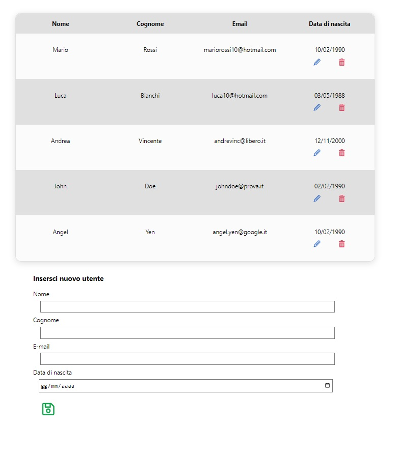
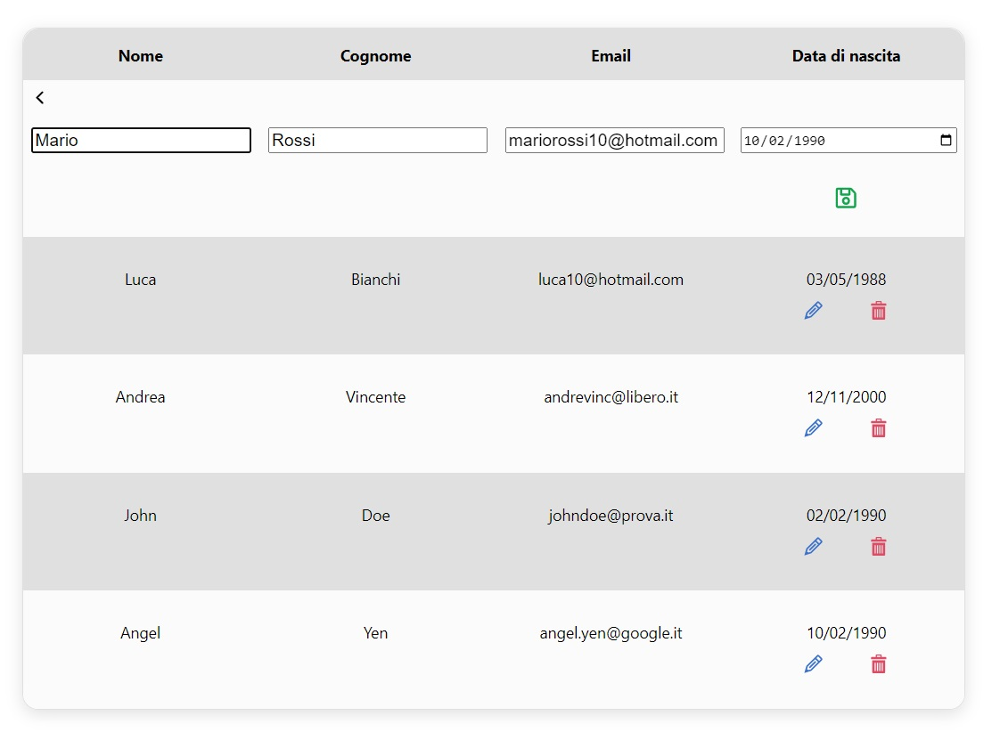
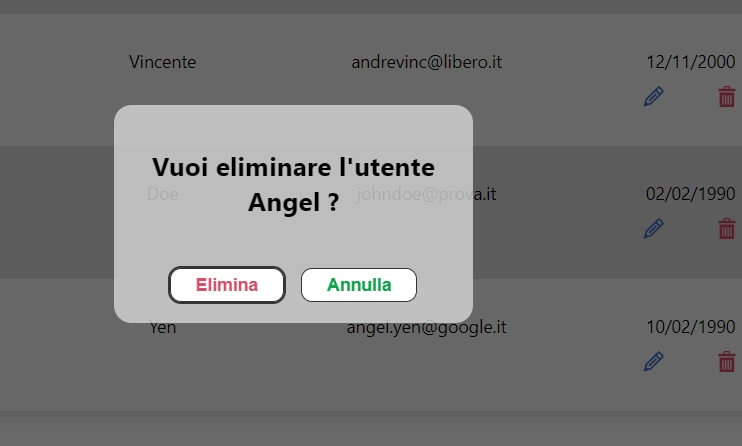

# **Scelte:** 

Trattandosi di un'app di piccole dimensioni, ho preferito evitare l'utilizzo di `Redux` per la gestione dello stato globale ed ho preferito il `context` già presente in React.

# **Organizzazione dei file:** 

## Cartella `./src` contiene:

* il file `index.js` ovvero **l'entry** point dell'app, essa importa un file `index.css` dove sono presenti una serie di variabili globali e renderizza il componente `App` avvolta dal componente `<AppProvider>` che si occupa di gestire stati e funzioni condivise.

* `App.js` contiene l'intera struttura dell'app, esso importa il proprio file `App.scss` che contiene classi generiche.

* `context.js` contiene le 4 operazioni fondamentali per effettuare operazioni sugli utenti lato server e la gestione di un `modal` che all'occorrenza mostra dei messaggi.

## Cartella `./module` contiene:

* `connectionFunctions.js` che si occupa di svolgere l'operazione di fetch e che gestisce l'esito della richiesta in modo da poterlo gestire in runtime.

## Cartella `./components` contiene:

* tutti i componenti che vengono utilizzati.

 

# **Screenshots:**

 

# **Modifica utente:**

 

# **Eliminazione utente:**

 